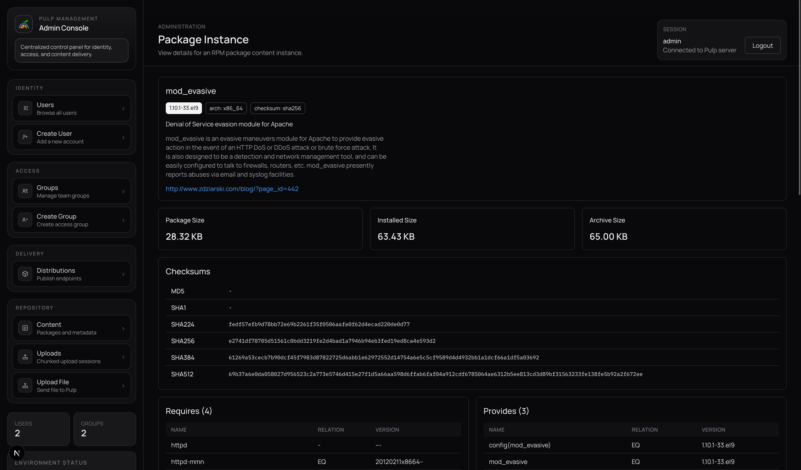
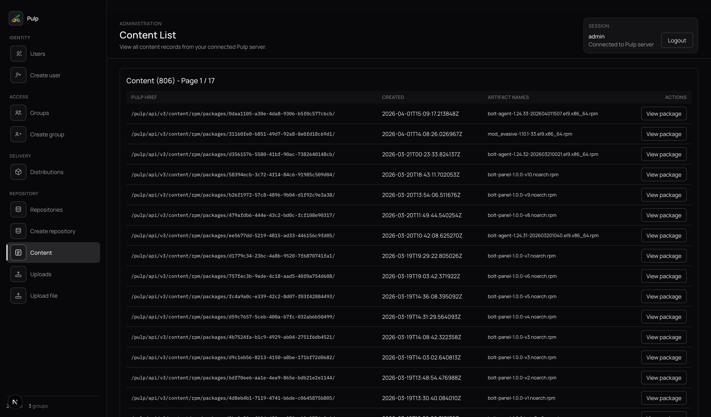
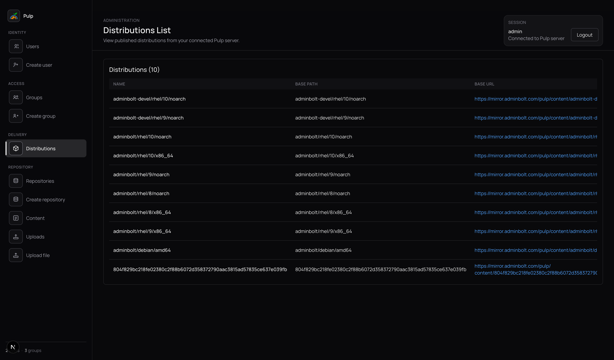
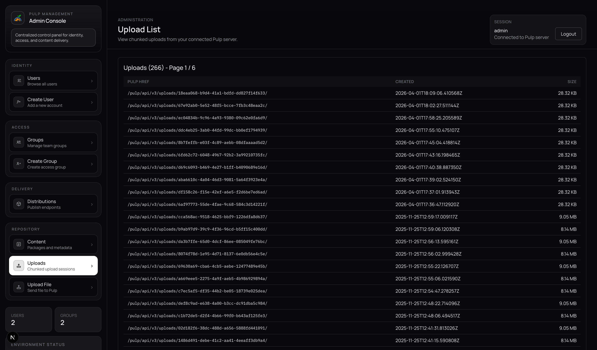
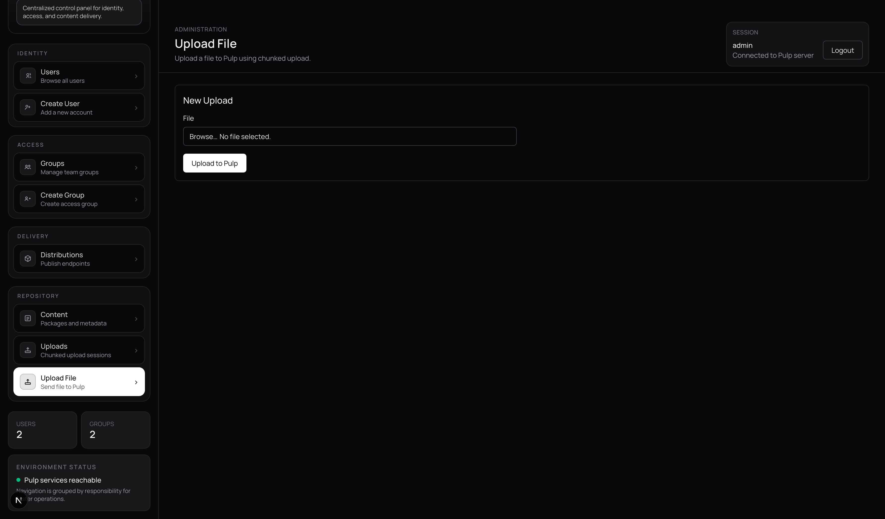

# Pulp Management UI

Web admin console for [Pulp 3](https://pulpproject.org/)—manage users, groups, distributions, RPM content, and file uploads against your Pulp API. Built with **Next.js** (App Router), **React 19**, **TypeScript**, and **Tailwind CSS**. Server routes proxy the Pulp REST API with cookie-based sessions.

## Features

- **Authentication** — Log in against Pulp; protected pages and API routes.
- **Users** — List and create Pulp users (staff/active flags, profile fields).
- **Groups** — List and create access groups.
- **Distributions** — Browse publication endpoints (base path, base URL, linked repository); edit fields and delete. **Create RPM distributions** from the repositories list (binds a new `distributions/rpm/rpm/` instance to an RPM repository with auto-generated name `«repo»-dist` and `base_path` equal to the repository name).
- **Content** — List RPM package content; open package detail (checksums, NVRA, artifact).
- **Uploads** — List upload sessions; **chunked upload** for large files; optional **create RPM content** from an artifact; **add content to an RPM repository** by name.

### Repositories (RPM & Debian APT)

- **List & switch** — Paginated list with **RPM** / **DEB** toggle; refresh; links to create, edit, content, publish, and delete.
- **Create** — New RPM or Debian APT repository by name.
- **Edit** — Load repository from Pulp; **patch** writable fields. **RPM** matches the Pulp `RpmRepository` serializer (name, description, `retain_repo_versions`, `remote`, `autopublish`, `metadata_signing_service`, `retain_package_versions`, metadata/package checksum types, `gpgcheck`, `repo_gpgcheck`, `sqlite_metadata`) plus read-only metadata (created time, latest version href, versions list href). **Debian** supports name, description, retain versions, remote, autopublish, structured repo flag.
- **Publish** — Trigger RPM or Debian publication; wait on async tasks when needed; **success panel** shows publication href and task when available (with robust parsing of `created_resources` from completed tasks). Failures surface in the session banner **above** the page content.
- **Repository content** — Same-repo content listing as before (query by `pulp_href`).
- **RPM version history** — **Versions** lists all `RpmRepositoryVersion` rows from `…/versions/` with **added / removed / present** content summaries per type (e.g. `rpm.package`). Rows link to a **version detail** page.
- **RPM single version** — **GET** instance (`…/versions/N/`): number, timestamps, hrefs, `base_version`, content summary. **Delete version** (Pulp `DELETE`) with confirmation; redirects back to the version list for the parent repository.
- **Distribute (RPM only)** — From the list, **Distribute** creates an RPM distribution pointing at that repository (`POST` proxied to Pulp); shows `base_url`, distribution href, optional task, and a shortcut to the distributions list.

### UI

- **Sidebar** — Compact left rail with grouped navigation (Identity, Access, Delivery, Repository), larger touch-friendly nav tiles with light motion (hover/active states, reduced-motion respected), and a small users/groups footer line.
- **Administration layout** — Session card and titles unchanged; **errors** render immediately under the header so failures (e.g. publish or API errors) are visible without scrolling past the main card.

## Screenshots

### RPM package detail



### Distributions



### Content list



### Upload sessions



### Upload file



## Getting started

1. Copy environment:

   ```bash
   cp .env.example .env
   ```

   Set `PULP_BASE_URL` to your Pulp API v3 base (e.g. `https://your-host/pulp/api/v3`).

2. Install and run:

   ```bash
   npm install
   npm run dev
   ```

3. Open [http://localhost:3000](http://localhost:3000) (redirects to the users list after login).

## Scripts

| Command        | Description        |
| -------------- | ------------------ |
| `npm run dev`  | Development server |
| `npm run build` | Production build  |
| `npm run start` | Start production  |
| `npm run lint`  | ESLint             |

## Discoverability

**Keywords:** pulp, pulp 3, pulp3, repository manager, RPM repository, YUM/DNF content, artifact upload, chunked file upload, distribution, publication, user management, group management, Next.js admin, React dashboard, TypeScript UI, Tailwind, Pulp REST API v3, content gateway, package hosting.
